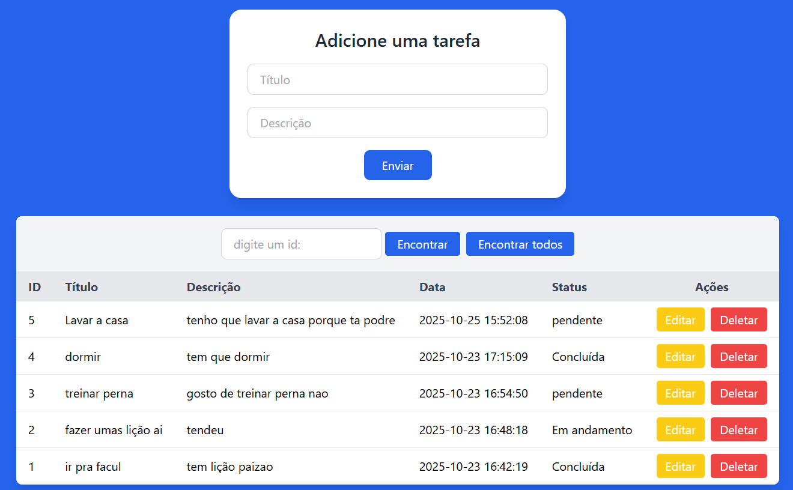

# To-Do List com Python, Flask e Redis  

Um projeto simples e funcional de **lista de tarefas (To-Do List)** desenvolvido com **Python + Flask** e **Redis** como banco de dados em memória.  
O objetivo é demonstrar como criar um **CRUD completo** (Create, Read, Update, Delete) usando tecnologias leves e rápidas.

## Funcionalidades

- ➕ **Adicionar tarefas** com título e descrição  
- 🔍 **Buscar tarefas** (todas ou por ID específico)  
- ✏️ **Editar tarefas** e atualizar status  
- ❌ **Excluir tarefas** individualmente  
- 🕒 **Registrar data de criação automaticamente**  
- 🧠 **IDs automáticos** gerados via Redis  
- 💾 **Armazenamento rápido** com Redis  

## 🧰 Tecnologias utilizadas

&nbsp;
&nbsp;
&nbsp;
&nbsp;

##
 

| Rota | Método | Descrição |
|------|--------|-----------|
| /buscar | GET | Retorna todos |
| /enviar | POST | Cria um novo |
| /editar | GET | Busca os dados para serem editados |
| /editarDados | POST | Edita o dado selecionado |
| /excluir | GET | Exclui um |
| /buscarId | POST | Retorna um |
